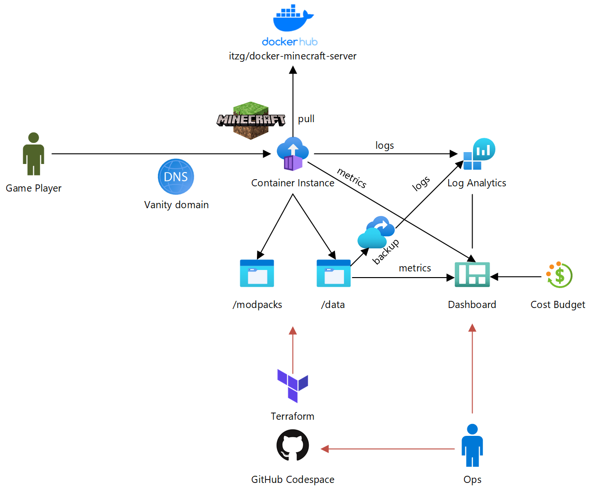

# Minecraft Server powered by Docker & Azure Container Instance
This project deploys [itzg/minecraft-server](https://hub.docker.com/r/itzg/minecraft-server) as [Azure Container Instance](https://azure.microsoft.com/en-us/services/container-instances/), using Terraform.




## Instructions
There are 2 ways to set this up:

### Codespace setup
The most easy is using a GitHub [Codespace](https://github.com/features/codespaces). Just create a GitHub Codespace from the Code menu. Wait for the Codespace to complete provisioning. When Codespace has completed provisioning and you open a terminal window (Ctrl-`, Control-backquote), you should see a message like this:
```
To provision infrastructure, make sure you're logged in with Azure CLI e.g. run 'az login'. Then, either:
 - change to the /home/codespace/workspace/azure-minecraft-docker/terraform directory and run 'terraform apply', or:
 - run /home/codespace/workspace/azure-minecraft-docker/scripts/deploy.ps1 -apply
To destroy, replace 'apply' with 'destroy' in above statements
```
Just follow these steps to provision Minecraft on Azure.
### Local setup
If you set this up locally, make sure you have the following pre-requisites:
- [Azure CLI](http://aka.ms/azure-cli)
- [PowerShell](https://github.com/PowerShell/PowerShell#get-powershell)
- [Terraform](https://www.terraform.io/downloads.html) (to get that you can use [tfenv](https://github.com/tfutils/tfenv) on Linux & macOS, [Homebrew](https://github.com/hashicorp/homebrew-tap) on macOS or [chocolatey](https://chocolatey.org/packages/terraform) on Windows)

Once you have those, you can go ahead and provision:
- Use Azure CLI for SSO with [Terraform](https://registry.terraform.io/providers/hashicorp/azurerm/latest/docs/guides/azure_cli): `az login`
- Initialize terraform: `terraform init`
- Provision cloud infrastructure: `terraform apply`

### Customization
You can customize the deployment by overriding defaulta for Terraform [input variables](https://www.terraform.io/docs/configuration/variables.html). The easiest way to do this is to copy config.auto.tfvars.example and save it as config.auto.tfvars.
- Use the `minecraft_users` array to define users allowed to log in
- `vanity_dns_zone_id` and `vanity_hostname_prefix` let you use a custom DNS name for the Minecraft server, using an Azure DNS managed domain
- Once things get serious, you may want to start backing up data with `enable_backup`

See [variables.tf](./terraform/variables.tf) for all input variables.


## Resources
- [Minecraft on Azure Friday (uses Docker CLI workflow)](https://www.youtube.com/watch?v=2D8FTi-Zvt0)
- [Minecraft on Docker Blog (uses Docker CLI workflow)](https://www.docker.com/blog/deploying-a-minecraft-docker-server-to-the-cloud/)
- [docker-minecraft-server on Github](https://github.com/itzg/docker-minecraft-server)